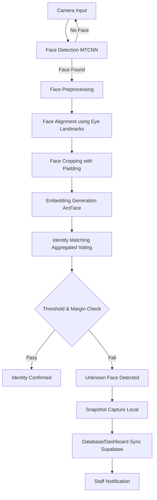

# Face Recognition Module - Technical Overview

This document provides a comprehensive technical overview of the Face Recognition module in the Shelter Monitoring System. It is generated from a thorough analysis of the system's source code, architecture, and deployment configurations.

## 1. System Overview

*   **Overall Purpose**: The Face Recognition module is designed to identify individuals entering the shelter, verify their identities against an enrolled database, and alert staff when an unrecognized person is detected.
*   **What Problem it Solves**: It replaces manual check-ins, automates the logging of shelter officers and staff, and provides real-time physical security by detecting unauthorized access (intrusions).
*   **Integration with Capstone System**: It acts as a critical edge-node sensor in the hybrid edge-cloud architecture. It runs locally on a Raspberry Pi (or laptop for testing), performs heavy inference locally, and syncs alerts and snapshot evidence to the centralized Supabase backend, which in turn triggers notifications on the React dashboard.
*   **Inputs**: Real-time video feeds from a local camera (e.g., Raspberry Pi Camera Module or standard USB webcam) provided as RGB/BGR image frames.
*   **Outputs**: 
    *   Annotated frames with bounding boxes and identity labels.
    *   Console logs and JSON session logs detailing timestamps, confidences, and bounding boxes.
    *   Alerts triggered in the cloud (Supabase `alerts` table) with corresponding snapshot evidence in the `cctv-evidence` bucket.
*   **Dependencies**: `OpenCV` (cv2), `NumPy`, `mtcnn` (Face Detection), `deepface` (ArcFace Recognition), `picamera2` (Hardware Interface), `supabase` (Cloud SDK), and `Pillow` (PIL).

---

## 2. Project Structure

The face recognition subsystem is located in `face_recognition/`. The primary files and their responsibilities are:

*   **`src/stage1/stage1_face_detect.py`**
    *   **Purpose**: Handles face detection, cropping, and facial alignment using MTCNN.
    *   **Main Functions**: 
        *   `detect_faces()`: Runs MTCNN and formats outputs.
        *   `align_face()`: Rotates the face to horizontally align the eyes.
        *   `crop_face()`: Extracts the face with symmetric padding.
    *   **Interactions**: Imported by live testing scripts to extract faces from video frames before passing them to the recognition stage.
*   **`src/stage2/stage2_face_recognition.py`**
    *   **Purpose**: Manages ArcFace embedding generation, enrollment, and identity matching.
    *   **Main Classes/Functions**:
        *   `FaceRecognizer`: Core class that loads embeddings and performs identity matching.
        *   `enroll_all()`, `enroll_single_image()`, `enroll_multiple_images()`: Builds the embedding database (`embeddings.npy`) from raw photos.
    *   **Interactions**: Takes cropped faces from Stage 1, calculates cosine similarity against the database, and returns the predicted identity or `"unknown"`.
*   **`src/stage1/webcam_test.py`**
    *   **Purpose**: A live execution script utilizing a laptop webcam for testing the entire pipeline.
    *   **Main Functions**: `run()`, `process_frame()`, `draw_hud()`.
    *   **Interactions**: Connects `cv2.VideoCapture` to `process_frame`, which calls Stage 1 and Stage 2 functions, and handles alert snapshot triggers.
*   **`src/pi_camera/pi_camera_test.py`**
    *   **Purpose**: The primary deployment script for the Raspberry Pi edge device.
    *   **Main Functions**: `run_pi()`.
    *   **Interactions**: Uses `Picamera2` to capture frames natively, passes them to `process_frame()`, and triggers Supabase uploads upon detecting unknowns.
*   **`src/pi_camera/supabase_uploader.py`**
    *   **Purpose**: Handles all communication with the Supabase cloud backend.
    *   **Main Functions**: `upload_snapshot_and_alert()`.
    *   **Interactions**: Uploads JPEG snapshots to storage and inserts relational records into `alerts` and `cctv_evidence`.
*   **`src/sync_employees.py`** & **`scripts/migrate_faces_to_supabase.py`**
    *   **Purpose**: Utilities for synchronizing enrollment photos between the edge device and the cloud.
*   **`models/` directory**
    *   **Purpose**: Local database storage containing `embeddings.npy` (the vector database) and `employee_metadata.json` (labels and thresholds).

---

## 3. Complete Execution Flow

The system processes video feeds continuously. When a person walks into the frame, the pipeline executes sequentially:

1.  **Camera Input**: `Picamera2` or `cv2.VideoCapture` captures an RGB frame.
2.  **Face Detection**: The frame is resized (640x480) and passed to MTCNN, returning bounding boxes and landmarks.
3.  **Face Preprocessing**: The detected face region is analyzed for eye positions.
4.  **Face Alignment**: The image is rotated via 2D affine transformation so the eyes are perfectly horizontal.
5.  **Face Cropping**: The aligned face is cropped with a 25px padding.
6.  **Embedding Generation**: The cropped face is passed to `DeepFace.represent()` utilizing the ArcFace model to generate a 512-dimensional vector.
7.  **Identity Matching**: Cosine similarity is calculated between the new embedding and all enrolled embeddings in RAM using an **Aggregated Voting** mechanism.
8.  **Threshold Checking**: The highest mean score is checked against an **Adaptive Threshold** (unique to that identity) and a **Margin** rule.
9.  **Unknown Detection**: If the threshold or margin checks fail, the identity defaults to `"unknown"`.
10. **Snapshot Capture**: If an `"unknown"` face is detected (and a 10-second cooldown has elapsed), an annotated frame is saved locally to `logs/snapshots/`.
11. **Database/Dashboard Sync**: A background thread asynchronously uploads the snapshot to Supabase and inserts a new `alert`.
12. **Notification**: The React frontend detects the new row in `alerts` and pushes a notification to staff.

---

## 4. Face Detection

*   **Model Used**: MTCNN (Multi-task Cascaded Convolutional Networks).
*   **Why it was chosen**: MTCNN is highly robust against variations in lighting and pose. More importantly, it natively outputs **5-point facial landmarks** (left eye, right eye, nose, mouth corners), which are absolutely essential for the face alignment step.
*   **Detection Parameters**: Images are resized to 640x480 prior to detection to speed up processing.
*   **Confidence Thresholds**: Configured at `0.80`. Boxes with confidence below this are discarded to minimize false positives from background noise.
*   **Bounding Box Generation**: MTCNN generates `[x, y, w, h]`, which are then scaled back up mathematically if the original image was larger than 640x480.
*   **Face Alignment**: Uses `np.arctan2` to find the angle between the left and right eye, then utilizes `cv2.getRotationMatrix2D` and `cv2.warpAffine` to level the face horizontally.
*   **Image Preprocessing**: Color conversion from OpenCV's native BGR to RGB, followed by a 25px bounding box padding (`PADDING = 25`) to ensure the entire facial structure (jawline, forehead) is captured before embedding generation.

---

## 5. Face Recognition

*   **ArcFace Implementation**: Wraps the DeepFace library to execute the ArcFace model (`MODEL_NAME = "ArcFace"`).
*   **Embedding Generation**: Takes the cropped, aligned RGB face and outputs a deep feature vector. DeepFace processes this via a temporary file bridge for live arrays.
*   **Embedding Dimension**: `512` dimensions.
*   **Similarity Calculation**: Uses Cosine Similarity `np.dot(a, b) / (||a|| * ||b||)`. 
*   **Distance Metric**: DeepFace natively returns Cosine Distance. The system manually converts this: `similarity = 1 - (distance / 2)` to operate in a logical `[0, 1]` similarity scale.
*   **Voting Mechanism (Aggregated Voting)**: Rather than taking a 1-Nearest Neighbor (1-NN) approach, the system calculates the **Mean** cosine similarity across *all* enrolled photos for a given identity. This mathematically prevents a single outlier enrollment photo from causing cross-identity confusion.
*   **Adaptive Threshold**: Unique per identity. Calculated during enrollment as: `mean(intra_class_sims) - 2 * std(intra_class_sims)`. Clamped between `0.30` and `0.55`. Identities with tight enrollment clusters receive stricter thresholds.
*   **Unknown Detection Logic**: An identity is rejected (marked as `"unknown"`) if:
    1.  The highest aggregated score is below the identity's Adaptive Threshold.
    2.  The margin between the 1st place score and 2nd place score is less than `MARGIN_MIN` (0.08). This explicitly prevents confusion between visually similar people (e.g., Sarah and Nanda).

---

## 6. Enrollment Process

*   **Dataset Structure**: `data/faces/<Identity_Name>/photo_1.jpg`.
*   **Registration Workflow**: The script iterates through directories, extracts valid face embeddings, and logs failures. Recommends `> 5` photos per person (`MIN_PHOTOS_WARN = 5`).
*   **Image Preprocessing**: Same as inference (MTCNN detection -> alignment -> padded crop).
*   **Embedding Creation**: Numpy `np.stack` merges all valid 512-D vectors into a single `(N, 512)` matrix.
*   **Storage Format**: `models/embeddings.npy` (Fast, optimized binary matrix loading).
*   **Metadata Storage**: `models/employee_metadata.json` maps `numpy` row indices to string names, original photo paths, and computed Adaptive Thresholds.

---

## 7. Event Trigger

*   **When Snapshots are Taken**: An event triggers when the identity resolves to `"unknown"`, signifying a potential unauthorized intrusion.
*   **Why Snapshots are Taken**: Provides actionable, visual evidence to staff on the dashboard, logging the exact face that triggered the alert.
*   **Continuous vs Event-Triggered**: The system uses **Event-Triggered Recording**. It processes frames continuously in RAM but only writes to disk/network when a strict condition (`has_unknown == True`) is met, saving massive amounts of storage and bandwidth. Implements a 10-second cooldown to prevent spamming.
*   **Storage Mechanism**: Initially saved to a local cache `logs/snapshots/unknown_*.jpg`, then uploaded to Supabase Storage via `supabase.storage.from_()`.

---

## 8. Dashboard Integration

*   **API Calls**: Handled by the `supabase-py` SDK over HTTPS.
*   **Database Interaction**: 
    1.  Inserts a record into the `alerts` table (`alert_type: "intrusion"`, `status: "open"`).
    2.  Inserts a linked record into the `cctv_evidence` table mapping the `alert_id` to the uploaded snapshot.
*   **Data Sent**: Alert metadata, timestamps, shelter ID, number of faces detected, and bounding box JSON payloads.
*   **Images Uploaded**: The full annotated frame (with drawn bounding boxes and HUD) is uploaded as a JPEG to the `cctv-evidence` bucket.
*   **Notifications Generated**: Because Supabase supports real-time subscriptions, the frontend dashboard instantly receives the new row in the `alerts` table and surfaces a visual notification to the operator.

---

## 9. Configuration

Configurable parameters are distributed across the Python files:

| Parameter | Default Value | Purpose | Effect if Changed |
| :--- | :--- | :--- | :--- |
| `CONFIDENCE_THRESHOLD` | `0.80` | Minimum confidence for MTCNN face box. | Lowering increases false positives (detecting background as face); raising misses occluded faces. |
| `PADDING` | `25` | Pixels added around the face crop. | Provides context for ArcFace. Too small = missing features; too large = background noise. |
| `BASE_SIMILARITY_THRESHOLD` | `0.45` | Fallback minimum cosine similarity. | Raising strictly rejects more faces (more unknowns); lowering risks false acceptances. |
| `MARGIN_MIN` | `0.08` | Required score gap between top 2 matching identities. | Raising requires a person to look *much* more like themselves than anyone else, directly solving confusion between similar employees. |
| `MIN_PHOTOS_WARN` | `5` | Warning threshold for enrollment count. | Purely informational. Reminds admins that Aggregated Voting needs diverse data. |
| `CAMERA_ID` | `"CAM_01"` | Logs the source of the feed. | Helps filter alerts on the dashboard if multiple cameras exist. |

---

## 10. Models Used

*   **MTCNN (Multi-task Cascaded Convolutional Networks)**: A neural network specifically designed for face detection and alignment. Loaded via the Python `mtcnn` package.
*   **ArcFace**: A state-of-the-art Deep Convolutional Neural Network for face recognition (extracting identity features). Loaded via the `deepface` library wrapper.
*   **Libraries**: `OpenCV` (image manipulation), `NumPy` (vector math), `Pillow` (image bridging), `Supabase` (Backend API).
*   **Model Loading**: Loaded once globally at script startup. `embeddings.npy` is loaded into RAM upon instantiation of the `FaceRecognizer` class.
*   **GPU/CPU Usage**: Deploys exclusively on **CPU** for edge nodes (Raspberry Pi). Inference speed is dictated entirely by CPU clock speed.

---

## 11. Performance Optimizations

*   **Image Resizing**: The 1080p camera feed is downscaled to 640x480 *before* running MTCNN. This drastically reduces the convolution math required, maintaining higher FPS.
*   **Async Processing**: When an alert triggers, `upload_snapshot_and_alert()` is spawned inside a Python `threading.Thread()`. This prevents the camera feed from pausing or lagging while waiting for the HTTPS upload to complete.
*   **Model Caching**: `embeddings.npy` is held in memory as a fast `numpy` matrix, allowing instantaneous matrix-multiplication for Cosine Similarity without disk I/O.
*   **Batch Enrollment**: Scripts like `enroll_multiple_images()` utilize `np.vstack()` to update the database without needing to rescan the entire dataset, optimizing cloud-to-edge synchronization.

---

## 12. Error Handling

*   **No Face**: If MTCNN returns zero bounding boxes, `alert_flag` is set to `True` with `alert_type = "no_face_detected"`.
*   **Multiple Faces**: The system loops over all valid bounding boxes in the frame. Time complexity scales linearly `O(N)`. Evaluates each face independently for unknowns.
*   **Unknown Face**: Defaults gracefully to `"unknown"` identity if thresholds fail. Triggers the alert system.
*   **Camera Failure**: If `cv2.VideoCapture` fails to open or drops the feed, the `cap.read()` loop explicitly breaks and calls `sys.exit()`.
*   **Model Loading Failure**: If DeepFace fails to extract an embedding (e.g., face too blurry), it catches the Exception, logs a warning, and returns `None`, bypassing the crash.
*   **Database Errors**: Supabase network failures in the uploader thread are caught by a generic `try/except Exception`, preventing the main video loop from dying due to a bad internet connection.

---

## 13. Current Limitations

*   **Hardware/Performance Bottlenecks**: `DeepFace.represent()` running ArcFace on a Raspberry Pi CPU is computationally heavy. Processing multiple faces in a single frame creates severe lag (dropping FPS).
*   **Recognition Limitations (Pose/Lighting)**: MTCNN and ArcFace struggle with extreme side-profiles (yaw > 45 degrees) and heavy backlighting.
*   **Linear Scaling**: Processing time scales linearly with the number of faces in the frame.
*   **False Positives/Negatives**: Small datasets (< 5 photos) for an identity can easily result in false negatives (flagged as unknown) or false positives (confusing two similar people) if the lighting differs from enrollment.

---

## 14. Suggested Improvements

1.  **Async Recognition Pipeline (High Priority)**
    *   *Why*: Currently, face recognition blocks the main camera thread.
    *   *Expected Improvement*: Decoupling frame grabbing from DeepFace inference using queues will keep the video feed smooth (30 FPS) while recognition catches up asynchronously.
    *   *Trade-offs*: Increases code complexity and RAM usage.
2.  **TFLite / ONNX Conversion (Medium Priority)**
    *   *Why*: Python DeepFace/Keras overhead is massive on edge devices.
    *   *Expected Improvement*: Converting the ArcFace model to TensorFlow Lite or ONNX C++ runtime could yield a 2x-4x speedup on Raspberry Pi.
    *   *Trade-offs*: Requires significant refactoring of the embedding generation logic.
3.  **Implement Object Tracking (SORT) (Medium Priority)**
    *   *Why*: The system currently runs deep learning on the *same face* every single frame.
    *   *Expected Improvement*: By tracking a bounding box (e.g., ID 45) across frames, we only need to run ArcFace recognition *once* per person, vastly reducing CPU load.
    *   *Trade-offs*: Trackers can lose ID upon occlusion, requiring logic to re-identify.
4.  **Hardware Acceleration (Low Priority)**
    *   *Why*: CPUs are not meant for real-time video AI.
    *   *Expected Improvement*: Attaching a Google Coral Edge TPU or utilizing a Pi 5 NPU.
    *   *Trade-offs*: Increases physical hardware cost per shelter.

---

## 15. Important Functions

| File | Function | Parameters | Return | Purpose | Calls |
| :--- | :--- | :--- | :--- | :--- | :--- |
| `stage1_face_detect.py` | `align_face()` | `image_rgb` (ndarray), `keypoints` (dict) | `ndarray` (aligned RGB image) | Rotates face so eyes are horizontal using 2D affine transform. | OpenCV math |
| `stage1_face_detect.py` | `crop_face()` | `image_rgb` (ndarray), `box` (list) | `ndarray` (cropped RGB face) | Extracts the face with symmetric padding. | None |
| `stage2_face_recognition.py` | `identify()` | `face_rgb` (ndarray) | `dict` (identity, similarity, alert flags) | Core logic. Gets embedding, aggregates scores, checks thresholds and margins. | `_get_embedding_from_array()`, `_aggregate_scores()` |
| `stage2_face_recognition.py` | `_aggregate_scores()` | `query_emb` (ndarray) | `dict` (name: mean_score) | Calculates mean cosine similarity across all enrolled photos for each identity. | `cosine_similarity()` |
| `webcam_test.py` | `process_frame()` | `frame_bgr`, `threshold`, `recognizer` | `tuple(ndarray, dict)` | Main inference orchestrator per frame. | `MTCNN.detect_faces()`, `align_face()`, `identify()` |
| `supabase_uploader.py` | `upload_snapshot_and_alert()`| `filepath`, `filename`, `detection_result` | `None` | Uploads image to bucket, inserts `alerts` and `cctv_evidence` rows. | `supabase.storage`, `supabase.table()` |

---

## 16. Technical Summary

*(Suitable for Capstone Defense / Abstract)*

The Face Recognition module of the Shelter Monitoring System is a hybrid edge-cloud computer vision pipeline designed for real-time access control. Running on edge hardware (Raspberry Pi), the system ingests live video, detects faces using MTCNN, and aligns them using 5-point facial landmarks. Identities are verified via a 512-dimensional ArcFace model wrapped by DeepFace. To guarantee high accuracy and prevent confusion between visually similar staff members, the system discards 1-Nearest Neighbor matching in favor of an **Aggregated Voting** mechanism, applying dynamic, intra-class **Adaptive Thresholds** alongside strict **Margin Enforcement**.

When the system detects an unauthorized individual, it executes an event-triggered evidence capture. The annotated frame is saved locally and uploaded asynchronously to a Supabase PostgreSQL backend via a background thread. This immediately populates the `alerts` and `cctv_evidence` tables, driving real-time WebSocket notifications to the React dashboard without compromising the edge device's inference loop. The architecture prioritizes bandwidth efficiency by running deep learning locally and only communicating with the cloud during intrusion events.
