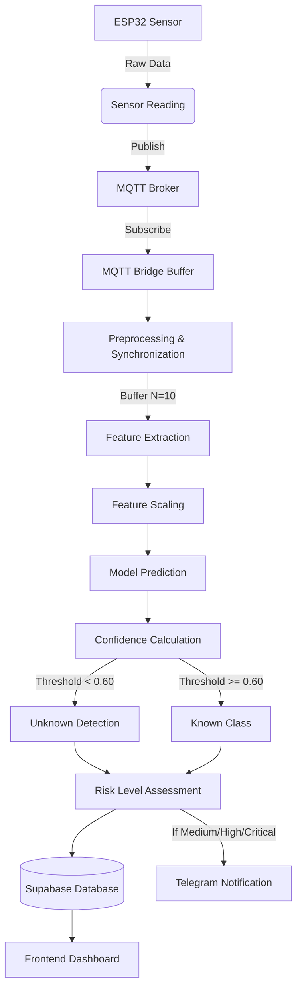

# Vibration AI Module - Technical Overview

## 1. System Overview
**Overall Purpose:**
The Vibration AI module is designed to monitor structural integrity and detect abnormal activities in remote shelters. It processes vibration data from edge devices to identify specific events (e.g., footsteps, vehicles, sabotage, or earthquakes) and issues real-time alerts.

**Problem Solved:**
Traditional vibration monitoring relies purely on static thresholds, which often result in false positives (e.g., heavy vehicles triggering sabotage alarms). This AI module adds intelligence to differentiate between various vibration sources, ensuring accurate risk assessment and reducing alert fatigue.

**Integration with Capstone System:**
Edge devices (ESP32) send raw accelerometer and gyroscope data via MQTT. The `mqtt_to_supabase.py` bridge subscribes to these topics, buffers the data, extracts features, runs the AI model, and pushes the enriched predictions (risk level, confidence) to a Supabase database. The frontend dashboard then visualizes this data, and critical alerts are sent via Telegram.

**Inputs:**
* Raw 3-axis acceleration (`accel_x`, `accel_y`, `accel_z`)
* Raw 3-axis gyroscope (`gyro_x`, `gyro_y`, `gyro_z`)
* Device and Shelter configuration (thresholds, tokens)

**Outputs:**
* Identified Event Label (e.g., "Sabotage/Maintenance", "Earthquake")
* Confidence Score (0.0 to 1.0)
* Risk Level ("low", "medium", "high", "critical")
* Real-time Database entries and Telegram Alerts

---

## 2. Project Structure
The module is primarily split between the `vibration_ai` training directory and the `bridge` deployment directory.

* `vibration_ai/1_feature_extractor.py`: Extracts statistical and time-domain features from raw audio (.wav) and sensor data (.json). Responsible for dataset preparation and normalization.
* `vibration_ai/2_model_trainer.py`: Loads extracted features, splits the dataset, trains a Random Forest classifier, and evaluates performance. Exports the model to `vibration_classifier.pkl`.
* `vibration_ai/common_schema.py`: Defines the `VibrationWindow` class, standardizing data from multiple sources (audio, real-life sensors) into a unified format before feature extraction.
* `bridge/mqtt_to_supabase.py`: The production bridge script. Handles MQTT subscriptions, pairs Accel/Gyro data, manages an AI buffer, performs real-time feature extraction, infers using the trained model, and inserts results into Supabase.

---

## 3. Complete Pipeline
The system operates on a real-time data streaming pipeline.

---

## 4. Dataset
**Dataset Source:**
The AI model is trained on a hybrid dataset combining internet-sourced audio datasets (.wav) and real-life sensor captures (.json).

**Classes:**
* `0`: Normal / AC (Baseline vibration)
* `1`: Footsteps (Human movement around the shelter)
* `2`: Sabotage / Maintenance (Intrusive actions, tampering)
* `3`: Vehicle (Passing cars or trucks)
* `4`: Earthquake (Seismic activity)

**Labeling & Organization:**
Data is organized into class-specific folders (e.g., `class_0_normal_AC`, `class_1_foot_steps`). The feature extractor dynamically assigns labels based on the folder index.

**Class Distribution:**
The dataset utilizes stratification during training to ensure balanced learning. Specifically, the trainer stratifies by a combination of `label + source` (e.g., "2_wav", "4_json_sensor") to ensure the model generalizes across both synthetic audio domains and real sensor domains.

---

## 5. Signal Processing
**Sampling:**
Raw audio data is resampled to **22050 Hz**. Raw JSON sensor data (typically 100 Hz) is interpolated and resampled to **22050 Hz** to match the audio domain, allowing the model to process both modalities interchangeably.

**Buffer Size & Window Length:**
In production (`mqtt_to_supabase.py`), the AI engine buffers **10 consecutive magnitude readings** before triggering inference. Since the default vibration transmission interval is 1000ms, this equates to a 10-second temporal window.

**Filtering & Normalization:**
* **Min-Max Scaling:** JSON sensor data is scaled to the `[-1.0, 1.0]` range to match the standard normalized output of `librosa` audio loading.
* **Micro-Vibration Bypass:** In production, if the dynamic range (`max - min`) of the 10-point buffer is less than **0.02g**, the signal is bypassed as purely static (Normal/AC) to save CPU cycles.

---

## 6. Feature Extraction
The pipeline extracts **14 features** per signal window.

1. **Zero Crossing Rate (ZCR):** The rate of sign-changes along the signal. Excellent for detecting high-frequency noise.
2. **Mean:** The average amplitude.
3. **Median Absolute Deviation (MAD):** A robust measure of the variability of a univariate sample. Resilient to outliers.
4. **Skewness:** Measures the asymmetry of the probability distribution. Indicates if shocks lean towards positive or negative spikes.
5. **Standard Deviation (STD):** The amount of variation or dispersion.
6. **Kurtosis:** Measures the "tailedness" of the distribution. High kurtosis indicates extreme outlier shocks (e.g., hammer strikes).
7. **Crest Factor:** Ratio of peak values to the RMS. High crest factor indicates sharp impacts (sabotage).
8. **Minimum Value:** The lowest amplitude peak.
9. **Maximum Value:** The highest amplitude peak.
10. **Range:** `Max - Min`. Represents the total amplitude swing.
11. **Median:** The middle value of the sorted signal.
12. **Interquartile Range (IQR):** Measures statistical dispersion (75th percentile - 25th percentile).
13. **Root Mean Square (RMS):** The square root of the mean squared signal. Represents the continuous power/energy of the vibration.
14. **Energy:** The sum of squared signal values. Measures the total severity of the event.

---

## 7. Machine Learning Model
**Algorithm:** `RandomForestClassifier` (Scikit-Learn).
**Why Chosen:** Random Forests are robust against overfitting, handle non-linear statistical features exceptionally well, do not require extensive deep learning compute, and provide probabilistic confidence scores perfectly suited for thresholding.

**Training Pipeline:**
1. Unified features are extracted and saved to `features_X.npy` and `features_y.npy`.
2. Data is split 80/20 with `stratify=y_strat` (label+source).
3. The model is trained on CPU.
4. An accuracy evaluation and per-source classification report are generated.

**Hyperparameters:** `n_estimators=100`, `random_state=42`.

**Model Inference:**
During runtime, the model is loaded via `joblib`. Extracted features from the live 10-point buffer are scaled using a pre-fitted `scaler.pkl` before being passed into `model.predict()` and `model.predict_proba()`.

---

## 8. Confidence Logic
**Prediction Probabilities:** `predict_proba` returns an array of probabilities across the 5 classes.
**Confidence Score:** The system extracts the maximum probability (`max_prob`) as the AI's confidence score.
**Unknown Threshold:** If `max_prob < 0.60` (60%), the prediction is discarded. The `ai_label` is set to `"Unknown"`, and the system sets `ai_fallback: True`.
**Risk Classification:**
If the AI is confident (>= 60%), the risk level is overridden by the class mapping:
* Normal/AC -> Low
* Footsteps -> Low
* Vehicle -> Medium
* Sabotage/Maintenance -> High
* Earthquake -> High

If AI bypasses or falls back to "Unknown", the system reverts to a **Conventional Risk** calculation based on raw magnitude thresholds (Warning: 10.0g / 0.3g, Critical: 20.0g / 0.7g).

---

## 9. MQTT Communication
**Topics:**
* Input: `+/Accel` (Accelerometer data)
* Input: `+/Gyro` (Gyroscope data)
* Output: `<token>/Config` (Dynamic sensor intervals pushed to ESP32)

**Payload:** JSON format containing `accel_x`, `accel_y`, `accel_z` (and gyro equivalents).

**Message Flow & Timing:**
Messages arrive asynchronously. The bridge uses a buffering dictionary (`_buffers`). When an `Accel` message arrives, it waits for a matching `Gyro` message. If the time difference between the two exceeds the `PAIR_TIMEOUT` (3.0 seconds), the older message is dropped to prevent desynchronized data insertion.

---

## 10. Dashboard Integration
**Database:** Supabase (PostgreSQL).
**Data Stored:** Combined JSON payload containing timestamp, shelter_id, device_id, raw accel/gyro axis data, computed `risk_level`, and a `metadata` JSON object containing AI inferences (`ai_label`, `ai_confidence`).
**Alerts:** If the final risk level is `medium`, `high`, or `critical`, a record is inserted into the `alerts` table.
**Notifications:** The `send_telegram()` function fires synchronously, pushing a message containing the AI Label, magnitude, and severity to registered Telegram Chat IDs.

---

## 11. Configuration
Key parameters configured in `.env` or dynamically loaded from the database:

| Parameter | Default | Purpose | Effect if Changed |
| :--- | :--- | :--- | :--- |
| `PAIR_TIMEOUT` | 3.0 sec | Max wait time between Accel and Gyro messages. | Higher = Tolerates network lag but might pair stale data. |
| `CONFIG_PUSH_INTERVAL` | 60 sec | How often MQTT bridge repushes config to ESP32. | Lower = Faster config sync, higher MQTT overhead. |
| `Unknown Threshold` | 0.60 | Min probability to trust AI model. | Higher = More "Unknown" labels, fewer false positives. |
| `Micro-Vibration Bypass` | 0.02g | Magnitude range threshold to skip AI. | Higher = Ignores more ambient noise, saving CPU. |
| `vibration_interval_ms` | 1000 ms | ESP32 publish rate (DB Configured). | Affects AI window time duration (N=10 = 10 sec at 1000ms). |

---

## 12. Performance
**Processing Speed:** Extremely fast. Feature extraction takes milliseconds. `RandomForest` inference on a 14-feature array is nearly instantaneous.
**Memory Usage:** Highly lightweight. The model footprint is < 5MB in RAM. The device state buffers only hold the last few MQTT packets.
**Bottlenecks:** The primary bottleneck is the 10-packet accumulation time. At 1 packet per second, the AI can only make a prediction every 10 seconds.
**Optimizations:** The 0.02g bypass optimization heavily reduces unnecessary CPU loads by instantly categorizing absolute silence as `Normal/AC`.

---

## 13. Error Handling
* **Missing Sensor Data:** If a Gyro message arrives but the Accel message is lost, the pairing timeout (3s) flushes the stale data.
* **MQTT Failure:** The Paho MQTT client utilizes `loop_forever()` and `on_disconnect` with automatic reconnection handling.
* **Invalid Features / AI Crash:** Enclosed in a `try/except` block. If feature extraction or inference fails, the system safely falls back (`ai_fallback: True`) and uses mathematical magnitude thresholds to assess risk.
* **Low Confidence (< 60%):** Flags the event as "Unknown" and relies on the hardcoded conventional thresholds.

---

## 14. Current Limitations
* **Dataset Domain Gap:** Training on 22050 Hz audio files and converting 100 Hz JSON sensor data to 22050 Hz introduces interpolation artifacts. The model might struggle if the real edge device data characteristics shift heavily.
* **Small Temporal Window:** A buffer of N=10 magnitude points is highly compressed. It strips out high-frequency vibrational nuances, reducing the feature space to just 10 points per inference.
* **Decoupled Axis:** The AI uses a combined Euclidean magnitude (`math.sqrt(x^2 + y^2 + z^2)`). Directional signatures (e.g., purely lateral shaking in an earthquake) are lost.

---

## 15. Suggested Improvements
1. **Move AI Inference to the Edge (High Priority)**
   * *Root Cause:* MQTT latency and 1Hz transmission limits bottleneck the AI.
   * *Expected Improvement:* Deploy a TensorFlow Lite Micro model directly to the ESP32. It can sample at 100Hz+ locally, extract features, and only send MQTT data when an anomaly is detected.
   * *Trade-offs:* ESP32 has limited RAM. Feature extraction must be written in C++.
2. **Train on Raw Axis Data (Medium Priority)**
   * *Root Cause:* Using magnitude loses 3D spatial information.
   * *Expected Improvement:* Extract features for X, Y, and Z independently (14 * 3 = 42 features). Improves classification of specific events like earthquakes.
   * *Trade-offs:* Increases model complexity and inference time slightly.
3. **Eliminate Audio Dataset Reliance (Low Priority)**
   * *Root Cause:* Audio signals and accelerometer signals have different mechanical properties.
   * *Expected Improvement:* Collect extensive real-world shelter data using the actual ESP32 sensors and re-train the model exclusively on native data.
   * *Trade-offs:* Highly time-consuming data collection process.

---

## 16. Important Functions
* **`extract_features_from_signal(signal)`**
  * *File:* `vibration_ai/1_feature_extractor.py` / `bridge/mqtt_to_supabase.py`
  * *Parameters:* `signal` (1D numpy array)
  * *Return Value:* List of 14 float features.
  * *Purpose:* Converts raw time-series data into statistical metrics for ML.
* **`process_windows(windows)`**
  * *File:* `vibration_ai/1_feature_extractor.py`
  * *Parameters:* List of `VibrationWindow` objects.
  * *Return Value:* X (features), y (labels), sources.
  * *Purpose:* Iterates over raw data, extracts features, and builds the training dataset arrays.
* **`insert_vibration(data, shelter_id, device_id)`**
  * *File:* `bridge/mqtt_to_supabase.py`
  * *Parameters:* MQTT JSON payload, UUIDs.
  * *Purpose:* Calculates magnitude, manages the N=10 buffer, executes AI inference, calculates risk, and inserts the row into Supabase. Calls Telegram alert functions if required.
* **`calc_risk_level(accel_x, accel_y, accel_z, shelter_id)`**
  * *File:* `bridge/mqtt_to_supabase.py`
  * *Purpose:* Fallback mechanism. Calculates standard magnitude risk against DB-configured thresholds if the AI is unsure or bypassed.

---

## 17. Technical Summary
The Vibration AI module represents a sophisticated leap from traditional threshold-based monitoring to intelligent, context-aware anomaly detection. By leveraging a real-time MQTT pipeline and a lightweight Random Forest classifier, the system successfully categorizes structural vibrations—such as footsteps, vehicular traffic, and earthquakes—with a high degree of confidence. While currently constrained by network-level buffering (N=10), its robust fallback mechanisms and seamless integration with Supabase and Telegram ensure that critical infrastructure remains protected around the clock. Future migrations to edge-based TFLite processing will further unlock the system's full potential, drastically improving temporal resolution and response times.
